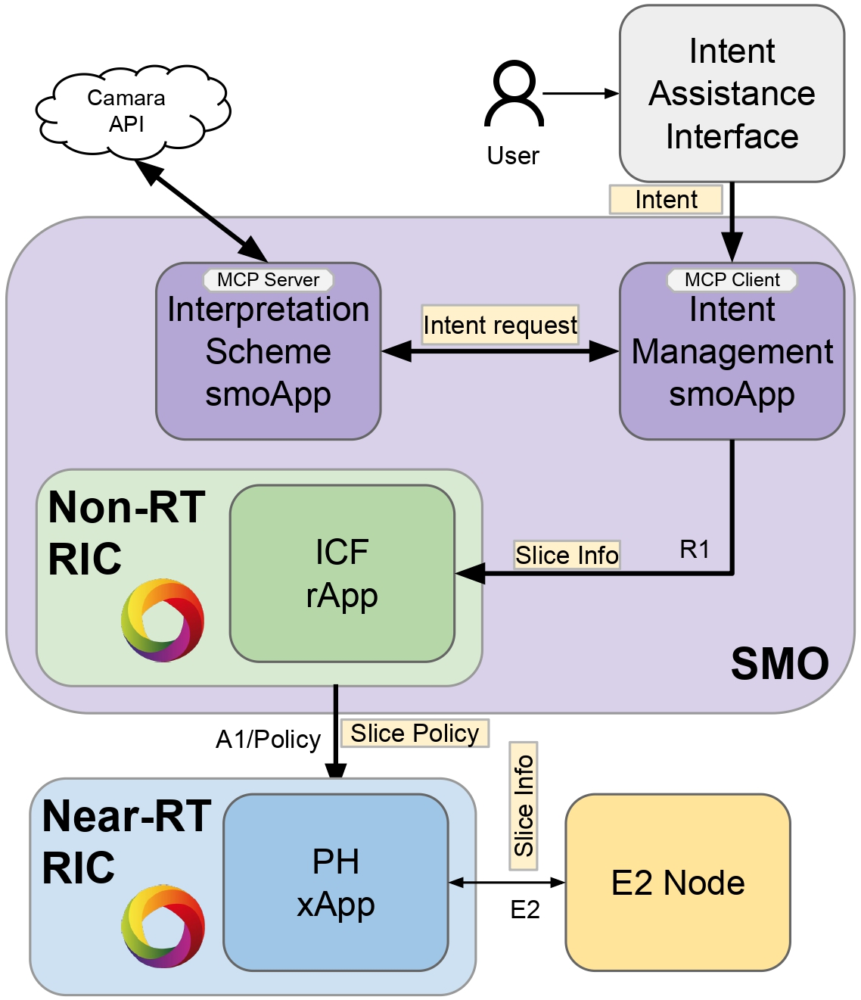

# ORION

**Intent-Aware Orchestration in Open RAN for SLA-Driven Network Management**

## Table of Contents

- [Introduction](#introduction)
- [Architecture](#architecture)
- [Prerequisites](#prerequisites)
- [Installation](#installation)
- [Local Development](#local-development)
- [Docker Images](#docker-images)
- [Kubernetes Deployment](#Kubernetes-deployment)

## Introduction

**ORION** is an intent-aware orchestration pipeline that aligns LLM-assisted intent capture with the SMO, Non-RT RIC, and Near-RT RIC roles, structuring slice-related requests through CAMARA’s NetworkSlice-Booking schema to ground translations in telecom semantics. Combines a conversational frontend, an MCP (Model Context Protocol) bridge, and reference services that emulate the target network APIs.

## Architecture

- **Streamlit Frontend (`src/frontend`)** – provides a chat-style UI that forwards intents to the MCP client API.
- **MCP Client API (`src/mcp_client`)** – FastAPI application that calls the MCP server using OpenAI tools and relays responses back to the UI.
- **MCP Server (`src/mcp_server`)** – exposes tools implemented with FastMCP, bridging to the reference Network Slice Booking API.
- **Network Slice Booking API (`src/slice_api`)** – FastAPI implementation of the CAMARA NSB specification.
- **rApp Service (`src/rApp`)** – FastAPI service that assembles policy payloads.



## Prerequisites

- **Python 3.10+**
- **Docker** (for containerization)
- **Kubernetes Cluster** (optional, for deployment)
- **Helm 3+** (optional, for Kubernetes deployment)
- **Access to an OpenAI API key** (for the MCP client)

## Installation

1. **Clone the repository and create a virtual environment:**

   ```bash
   git clone https://github.com/gabiSmachado/intent.git
   cd intent
   ```

2. **Set Up Virtual Environment:**

   ```bash
   python3 -m venv .venv
   source .venv/bin/activate
   ```

3. **Install Dependencies:**

   ```bash
   pip install -r requirements.txt
   ```

## Local Development

1. **Network Slice Booking API**

   ```bash
   cd src/slice_api
   pip install -r requirements.txt
   uvicorn main:app --host 0.0.0.0 --port 8002 --reload
   ```

2. **MCP Server** (requires `slice_api` running)

   ```bash
   cd src/mcp_server
   pip install -r requirements.txt
   python server.py
   ```

3. **MCP Client API**

   ```bash
   cd src/mcp_client
   pip install -r requirements.txt
   uvicorn main:app --host 0.0.0.0 --port 9100 --reload
   ```

4. **Streamlit Frontend**

   ```bash
   cd src/frontend
   pip install -r requirements.txt
   streamlit run main.py
   ```

5. **rApp Service**
   ```bash
   cd src/rApp
   pip install -r requirements.txt
   uvicorn rApp:app --host 0.0.0.0 --port 8090 --reload
   ```

The configuration for each service is stored in its respective `config/config.yaml` file. Host and ports are already aligned with the Helm deployment defaults; adjust as needed for local runs.

## Docker Images

Every service directory under `src/` has a `Dockerfile` and a script to build the Docker image:

```bash
./build_and_push.sh
```

Update each script with your registry credentials or run the `docker build` command manually.

## Kubernetes Deployment

Helm charts for each component are stored in `helm/<service>/`. To deploy the frontend, for example:

```bash
helm install intent-frontend helm/frontend
```

Values files contain defaults for service ports. Modify the `values.yaml` file to set configuration parameters as needed.
